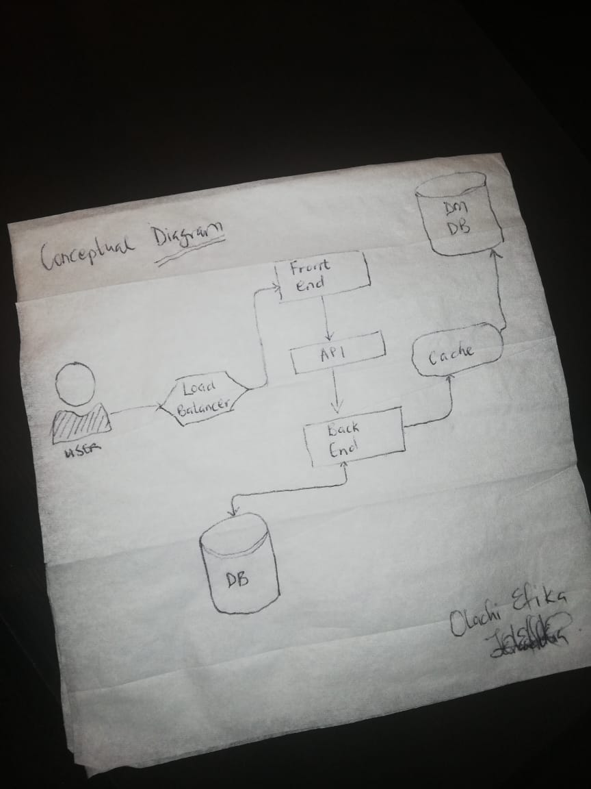

# Week 0 — Billing and Architecture

**This week**
- I worked on the Billing and Architecture set-up of the Cruddur Application
- In setting up the AWS account, security and spending considerations were a priority.
- In order to ensure that the root account is secure, I generated separate IAM user credentials
- I also set up MFA for the root & new user account
- I also installed the AWS CLI 
- To monitor and manage resource spending, I created a billing alarm and a budget
- I recreated the Conceptual Diagram for the Cruddur App on a Napkin  
- I recreated the Logical Architectural Diagram in Lucid Charts 
- [This is the link to the lucid chart](https://lucid.app/lucidchart/dbe31b17-a139-4869-9bbf-71db56c3bb0d/edit?invitationId=inv_8ce40e6b-7d09-497d-99dc-3aac9b881a08&page=0_0#) 
